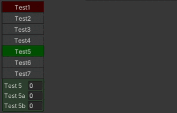

# CompactTabGroup for Odin



## Tab group which tabs respect available space

It has the same features as regular Odin Tab group, except it has different default group name (`_DefaultCompactTabGroup`) and you can set color for tab and its contents.

## Instalation

Put `CompactTabGroup` folder into Unity project

## Example

It will produce the same result as in the preview gif

```cs
[HorizontalGroup("Hor", 0.2f, LabelWidth = 50)]
[SerializeField, CompactTabGroup("Hor/Tab", "Test1", color: "@Color.red")] private float m_test1;
[SerializeField, CompactTabGroup("Hor/Tab", "Test2")] private float m_test2;
[SerializeField, CompactTabGroup("Hor/Tab", "Test3")] private float m_test3;
[SerializeField, CompactTabGroup("Hor/Tab", "Test3")] private float m_test3a;
[SerializeField, CompactTabGroup("Hor/Tab", "Test4")] private float m_test4;
[SerializeField, CompactTabGroup("Hor/Tab", "Test5")] private float m_test5;
[SerializeField, CompactTabGroup("Hor/Tab", "Test5", color: "@Color.green")] private float m_test5a;
[SerializeField, CompactTabGroup("Hor/Tab", "Test5")] private float m_test5b;
[SerializeField, CompactTabGroup("Hor/Tab", "Test6")] private float m_test6;
[SerializeField, CompactTabGroup("Hor/Tab", "Test7")] private float m_test7;
[SerializeField, CompactTabGroup("Hor/Tab/Test7/Ver", "Test")] private float m_test8;
[SerializeField, CompactTabGroup("Hor/Tab/Test7/Ver", "Test")] private float m_test8a;
[SerializeField, CompactTabGroup("Hor/Tab/Test7/Ver", "Test")] private float m_test8b;
[SerializeField, CompactTabGroup("Hor/Tab/Test7/Ver", "Test11")] private float m_test9;

[HorizontalGroup("Hor")]
[SerializeField, LabelText(" "), LabelWidth(900)] private float m_test1a;
```
