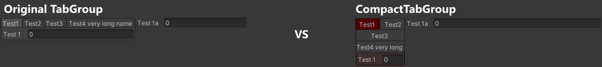

# CompactTabGroup for Odin


## Tab group which tabs respect available space

It has the same features as original Odin `TabGroup`, except it has different default group name (`_DefaultCompactTabGroup`) and you can set color for tab and its contents.

## Instalation

Put `CompactTabGroup` folder into Unity project

## Usage

The attribute has the same parameters as original `TabGroup` [Documentation](https://odininspector.com/attributes/tab-group-attribute)

The only extra parameter is `color`. Put ia a string that can be evaluated as a method or a property that returns `Unity.Color`, for example: `"@Color.red"` will return a red color.

## Comparison



The same tabs setup is used in both cases. The original `TabGroup` has all tab buttons in line and they cannot be squeezed, which results in not respecting desired width of 20% set in `HorizontalGroup`. `CompactTabGroup` respects desired width, even at a cost of cutting off tab names. You can still see full name as it is available as a tooltip when hovering over that button.

Code used for this comparison
```cs
[HorizontalGroup("Hor", 0.2f, LabelWidth = 50)]
[SerializeField, CompactTabGroup("Hor/Tab", "Test1", color: "@Color.red")] private float m_test1;
[SerializeField, CompactTabGroup("Hor/Tab", "Test2")] private float m_test2;
[SerializeField, CompactTabGroup("Hor/Tab", "Test3")] private float m_test3;
[SerializeField, CompactTabGroup("Hor/Tab", "Test3")] private float m_test3a;
[SerializeField, CompactTabGroup("Hor/Tab", "Test4 very long name")] private float m_test4;

[HorizontalGroup("Hor")]
[SerializeField] private float m_test1a;
```
